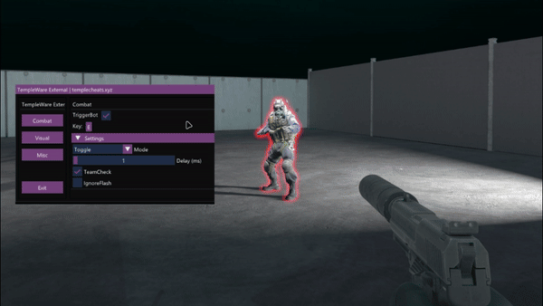

  

 

  
  
  
  
  
  

---
### TempleWare-External is a open-source CS2 External Cheat written in C++.
---

### How to Build and Launch TempleWare-External

1. **Build the Executable:**
   - Open the project in Visual Studio.
   - Set the build configuration to **Release x64**.
   - Build the solution (`Build` > `Build Solution`).
   - Find the `TempleWare-External.exe` in the `\Release\x64\` folder.

2. **Run the Executable:**
   - Double-click the `TempleWare-External` file to launch it.
   - The tool will handle any necessary processes automatically.

3. **Play CS2:**
   - Launch `Counter-Strike 2` and start using TempleWare.
   - Use the `END` key to open the menu.
  
---

## Showcase

  

