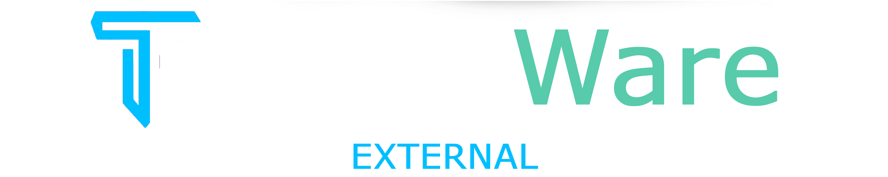
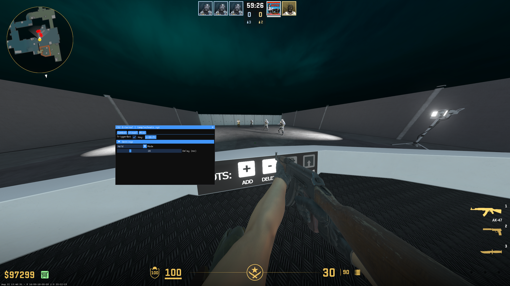

  

 

  
  
  
  
  
  

---
### An open-source external cheat base for Counter-Strike 2, written in C++.
---

## Features

Visual

  
- No Flash
- Fov Changer

Trigger Bot

- Shot Delay

Misc

  
- Menu Accent Color Selector
- Rainbow Menu

## Screenshots
Preview
:-:|:-:

<b>Disclaimer:</b> Use at your own risk.

